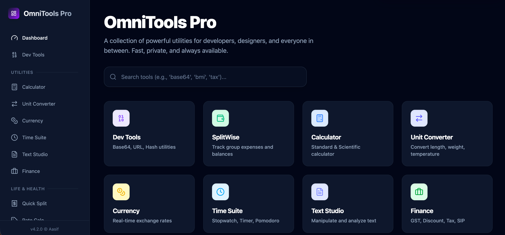
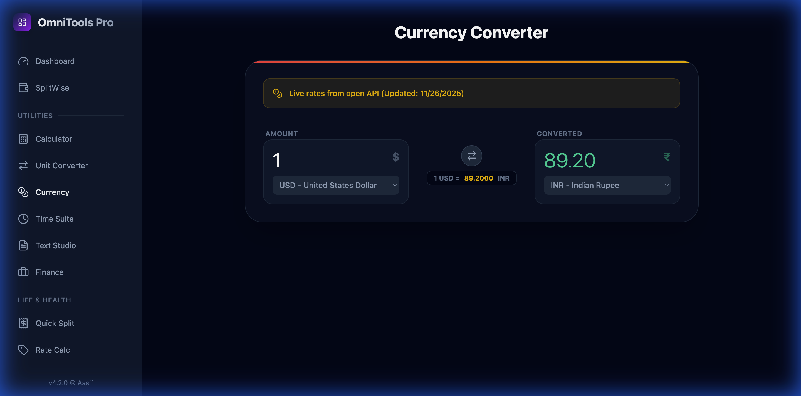
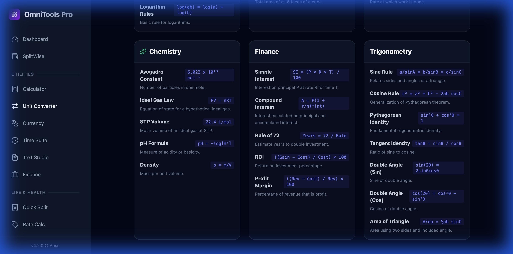
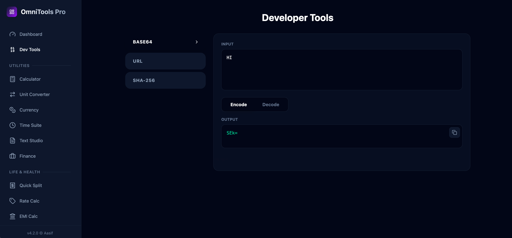
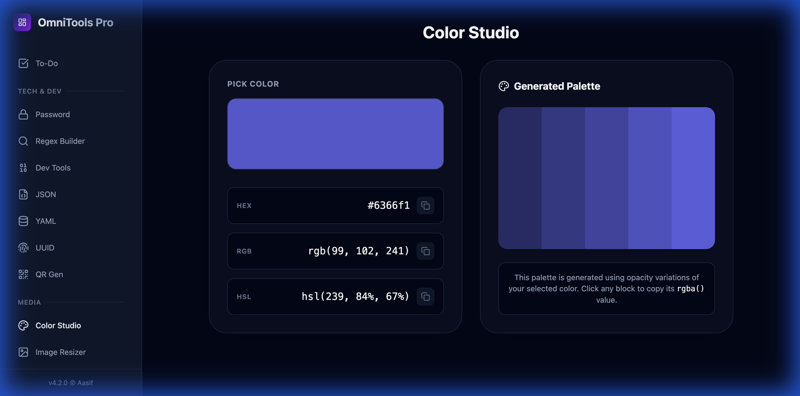
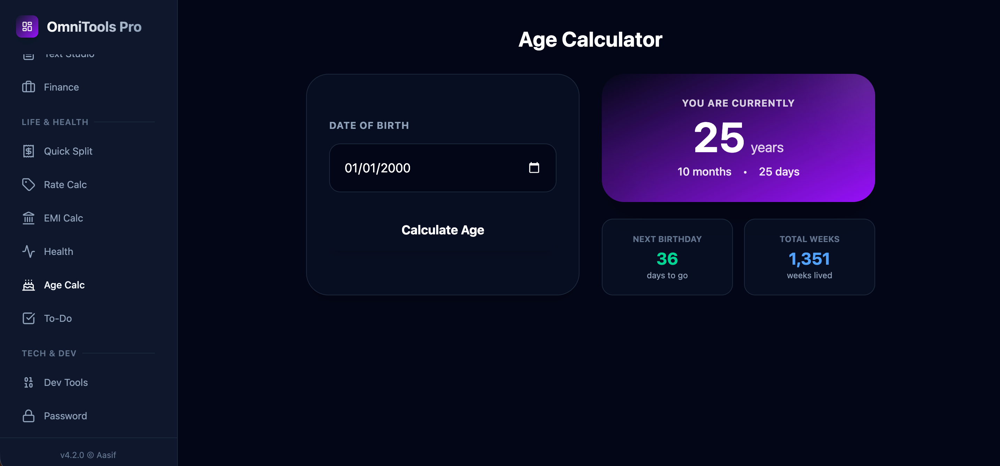

# 🛠️ OmniTools

> **The Ultimate All-in-One Utility Suite for Developers & Everyone.**  
> Fast, Private, Client-Side. No Login Required.


---

## 🚀 Overview

**OmniTools** is a powerful, dark-themed web application that bundles dozens of essential tools into one beautiful interface. Whether you're a developer needing to debug JSON, a designer picking colors, or just need to split a bill, OmniTools has you covered.



---

## ✨ Key Features

### 🧮 Core Utilities
Everything you need for daily calculations.

- **Currency Converter**: Real-time rates (API-driven) with support for 160+ currencies.
- **Unit Converter**: Comprehensive converter with a built-in **Formulas & Constants** reference.
- **Calculator**: Scientific calculator with history tape.

| Currency Converter | Formulas Reference |
|:---:|:---:|
|  |  |

### 👨‍💻 Developer Tools
Built by developers, for developers.

- **DevTools**: Base64 Encoder/Decoder, URL Encoder, Hash Generator (SHA/MD5).
- **Formatters**: JSON Formatter/Validator, YAML Converter.
- **Regex Builder**: Visual builder for regular expressions.
- **UUID & QR**: Generate UUIDs and QR codes instantly.



### 🎨 Design & Media
Tools for creatives.

- **Color Studio**: Advanced color picker, palette generator, and contrast checker.
- **Image Tools**: Client-side Image Resizer and Aspect Ratio Calculator.



### 🧬 Life & Health
Smart tools for everyday life.

- **Age Calculator**: Precise age calculation with next birthday countdown.
- **SplitWise**: Track group expenses and settle debts.
- **Health**: BMI & BMR calculators.



---

## 📦 Installation

Run OmniTools locally on your machine.

```bash
# 1. Clone the repository
git clone https://github.com/yourusername/omnitools.git

# 2. Navigate to directory
cd omnitools

# 3. Install dependencies
npm install

# 4. Start development server
npm run dev
```

---

## 📄 License

**NON-COMMERCIAL USE ONLY**

This project is licensed under a custom **Non-Commercial License**.
- ✅ You **can** use this for personal learning, hobbies, and non-profit projects.
- ❌ You **cannot** use this for commercial purposes.
- ❌ You **cannot** sell, rent, or lease this software.

See the [LICENSE](LICENSE) file for details.

---

Made with ❤️ by **Aasif**